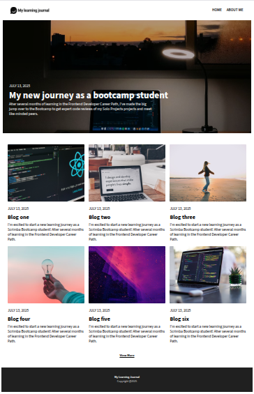

# Learning Journal

A clean, responsive personal blog-style project built using **vanilla HTML, CSS, and JavaScript**, and deployed using **Astro**. This project is part of the **Scrimba Frontend Developer Career Path** and demonstrates fundamental web development practices including semantic HTML, layout design, and modular structure.

**🔗 Live Demo**: [learning-journal.pablolebed.dev](https://learning-journal.pablolebed.dev)

## 📸 Preview

 <!-- Optional: Replace with actual screenshot if available -->

## 🧰 Tech Stack

* **HTML5**
* **CSS3**
* **Vanilla JavaScript (ES6)**
* **Astro** (for deployment and structure)
* **Deployed with Caddy on Ubuntu server**

## 📁 Project Structure

```
learning-journal/
├── public/              # Static assets (favicon, images, etc.)
├── src/
│   ├── components/      # Reusable HTML partials or Astro components (if used)
│   ├── pages/           # Page content (e.g., index.astro, about.astro)
│   ├── styles/          # Global and modular CSS
│   └── scripts/         # JavaScript files
├── astro.config.mjs     # Astro configuration
├── package.json
├── README.md
└── vite.config.js
```

## 🚀 Setup & Development

To run the project locally:

```bash
git clone https://github.com/your-username/learning-journal.git
cd learning-journal
npm install
npm run dev
```

Then open [http://localhost:4321](http://localhost:4321) in your browser.

## 📦 Build for Production

```bash
npm run build
```

## 🧑‍💻 Author

**Pablo Lebed**
Frontend Developer in transition from Analytical Chemistry.
[Portfolio](https://www.pablolebed.dev)

## 📄 License

This project is open source and available under the [MIT License](./LICENSE).
